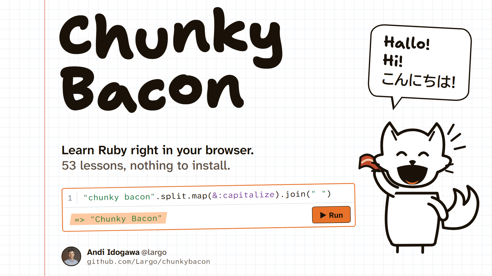

# Ruby lernen mit Chunky Bacon 🦊🥓



Learn Ruby in your browser — an interactive, notebook-style course in
**German, English and Japanese**. No setup: Ruby itself runs client-side via
[ruby.wasm](https://github.com/ruby/ruby.wasm).

## What's inside

- **51 lessons** from `puts "Hallo, Welt!"` to classes, modules, IRB,
  gems, HTML parsing with Nokogiri, exact arithmetic with BigDecimal, web
  routing with Sinatra and Roda, 3D graphics, tables, frames and colours
  for the terminal with the [TTY toolkit](https://ttytoolkit.org),
  sketches that move and follow the mouse with
  [Processing](https://github.com/xord/processing), test data that looks
  real with [Faker](https://github.com/faker-ruby/faker), ERB templates
  checked by [Herb](https://herb-tools.dev) (its C parser as WebAssembly),
  PowerPoint decks with [ruby_pptx](https://github.com/Largo/ruby_pptx),
  PDFs with Prawn and HexaPDF, JPEG photos with
  [pure_jpeg](https://github.com/peterc/pure_jpeg), pandas, SymPy, NumPy,
  charts with matplotlib and machine learning with scikit-learn from Ruby through
  [PyCall](https://github.com/mrkn/pycall.rb), machine learning in Ruby
  itself with [Rumale](https://github.com/yoshoku/rumale) (a postcode you
  write on a letter, read by a nearest-neighbours classifier), a SQLite
  database with [Sequel](https://sequel.jeremyevans.net), a look at the Ruby
  community (RubyKaigi, weird code, how IRB reads code), and
  a project track that builds a small time tracker.
- **Notebook UI**: lessons interleave text with runnable CodeMirror
  cells (Shift+Enter). All cells of a lesson share one binding, and every
  cell shows its last expression as `=> …` — `puts` is never required.
- **Errors explained kindly**: when a cell fails, a short explanation in
  the lesson's language (German, English, Japanese) says what went wrong
  and what to write instead, with the line and a caret under the culprit
  (`6 x 7` → "Ruby multiplies with `*`"; a missing `end` names the `def`
  that lost it; `fox["name"]` on a hash with symbol keys suggests
  `fox[:name]`). Ruby's own message stays one click away. 44 rules,
  checked against 70 typical beginner mistakes drawn from the exercises.
- **Lesson sidebar**: the 51 lessons in three groups (basics, side trips,
  the timelog track) with done counts, ticks and a bacon progress strip,
  searchable and foldable; it can be put away, and on a phone it is a
  drawer.
- **Keyboard and screen readers**: a skip link past the index, editors
  that Escape, then Tab leaves, Run buttons named with their cell that keep
  the focus, a status line that reads out what a run printed and what
  Chunky says, the focus on the new lesson's heading after every lesson
  change, a modal drawer on a phone, named widgets (IRB, mini browser, 3D)
  and contrast at WCAG AA (audit: `experiments/10-accessibility`).
- **Live runs**: a cell runs by itself a second after you stop typing, as
  long as the code parses - a rehearsal that keeps no file it writes,
  installs only gems already in the cache, fetches nothing from the web and
  is stopped after a second; ▶ runs the code for real. Chunky only speaks
  up when an exercise passes. On in the lessons, off in the workshop (the
  ⚡ Live switch beside ▶).
- **In-browser gem installer**: pure-Ruby gems install at runtime
  (`install_gem "chunky_png"`), fetched from a local cache or from
  rubygems.org through a same-origin nginx proxy, and unpacked onto the
  wasm filesystem (writable memory) with their declared load paths on
  `$LOAD_PATH` - so `require`, `require_relative`, `autoload`, `__dir__`
  and data files next to `lib/` behave as on disk.
- **Nokogiri in the browser**: the cache holds
  [nokogiri-pure](https://github.com/Largo/nokogiri-pure) - Nokogiri
  1.19.4 with its C extension, libxml2, libxslt and gumbo ported to Ruby -
  built under the name `nokogiri`, so gems that depend on nokogiri
  (loofah, sanitize, rails-html-sanitizer, premailer, feedjira, rubyXL,
  roo, caxlsx, reverse_markdown …) install and run too. Other native gems
  fail with a friendly explanation of the wasm limitation that names the
  gem with the C code (often a dependency), unless it is built into the
  wasm image (json, date, openssl …), has a pure-Ruby stand-in (Numo, the
  arrays under Rumale: `html/numo_narray.rb`; sqlite3, on
  [sql.js](https://sql.js.org) - SQLite in WebAssembly, loaded only when
  needed - so Sequel's own SQLite adapter runs, and `Sequel.sqlite("x.db")`
  is a real SQLite file you can download: `html/sqlite3_sqljs.rb`;
  Processing, which draws through OpenGL: `html/processing.rb`; in the
  cache, `SUBSTITUTES`: a dependency on `bigdecimal` installs
  [bigdecimal-pure](https://github.com/Largo/bigdecimal-pure), which
  unblocks activesupport, liquid, prawn, dry-types …) or the gem that
  wants it can do without it (`OPTIONAL_NATIVE_DEPS`: ruby_pptx falls
  back to REXML).
- **Downloads**: any file a cell writes - `deck.save("chunky.pptx")`,
  `File.write("notes.txt", …)` - appears below the cell as a download link;
  `download_file(data, "name")` offers data that never went through a file,
  and `show_pdf` puts a PDF in the browser's own viewer below the cell.
- **Workshop**: beside the lessons, a small IDE for your own multi-file
  programs - `require_relative` between files, `File.read`/`File.write` on
  the project, input for `gets`, pictures and PDFs it writes previewed and
  kept, SQLite databases kept with the project, files renamable - with every
  widget below available.
- **Your progress stays yours**: nothing is stored on a server. Progress,
  code and workshop files live in the browser and can be saved as a progress
  file (download, load again, merged key by key) or - in Chrome and Edge over
  https - into a connected folder, where workshop files are real files.
- **Offline, if you like**: one click keeps the whole course on your device
  (about 101 MB, or 49 MB with Python left out - a checkbox), and it opens
  and runs without a connection - lessons, cells, the bundled gems, Python.
  Online it always loads the current version, and the copy updates itself.
- **Python next to Ruby**: the PyCall lessons run real pandas, SymPy, NumPy,
  matplotlib (its charts drawn as SVG below the cell) and scikit-learn -
  [Pyodide](https://pyodide.org), CPython in WebAssembly, loaded only for
  those lessons, each with just the packages it imports - through a small
  bridge with the pycall gem's API (`html/pycall.rb`), so their code runs
  unchanged with the real gem.
- **Interactive widgets**: `show_irb` (a real IRB terminal with `_`,
  multi-line input, and authentic prompts), `show_browser` (a fake
  browser window that speaks Rack directly to your Sinatra/Roda app),
  `show_image` (inline pictures: PNGs from chunky_png, JPEGs from
  pure_jpeg), `show_three` (a WebGL stage for scenes built with
  [three-rb](https://github.com/lef237/three-rb), optionally animated per
  frame and orbitable with the mouse), and `show_letter` (an envelope to
  write a postcode on with mouse or finger; a Ruby block reads it).
- **A terminal below each cell**: colours from ANSI escape codes (pastel,
  test runners) show as colours, and box-drawing characters (`┌─┐`, from
  tty-table, tty-box) are as wide as the code font's letters, so tables
  line up.
- **Processing sketches**: `setup` and `draw` from the processing gem run
  below the cell, about 60 frames a second, and hear the mouse and the
  keys - the gem's API in pure Ruby, painted on a canvas.
- Chunky Bacon, an original cartoon fox, cheers you on.

## On your own computer: the chunky_bacon gem

[`gem/chunky_bacon`](gem/chunky_bacon) gives a Ruby program on your own
computer the course's helpers (`show_image`, `show_browser`,
`download_file`, ...), so code from the lessons and the workshop runs
unchanged. `chunkybacon run` starts a program with them loaded.
[`gem/chunkybacon`](gem/chunkybacon) and [`gem/chunky-bacon`](gem/chunky-bacon)
are aliases: all three names install the same gem.

## Architecture

For operations, internals and traps see [docs/HANDOVER.md](docs/HANDOVER.md).

The page runs on two Rubies: [PicoRuby.wasm](https://github.com/picoruby/picoruby)
(0.9 MB) draws everything you read within a fraction of a second, while
CRuby's ruby.wasm (10 MB) loads behind it and runs the code - see
[docs/PICORUBY_SHELL.md](docs/PICORUBY_SHELL.md).

Built on the same foundation as
[BrowserRubyKoans](https://github.com/Largo/BrowserRubyKoans)
(koans.idogawa.com): `browser.script.iife.js` + `ruby-app.wasm` with app
logic written in Ruby (`html/main.rb`) via the JS bridge. Lesson content
lives in `html/lessons.js`; the gem loader in `html/browser_gems.rb`
unpacks `.gem` files in Ruby onto the wasm filesystem, and hooks `require`
for shims of stdlib that cannot load in WASI (socket, net/http over the
browser's fetch, resolv).

three.js is vendored under `html/assets/three/` and imported lazily
(`window.ensureThree` in `index.html`) only by lessons whose cells call
`show_three` - three-rb builds the scene graph in Ruby and looks the
library up as `globalThis.THREE`. All stages on the page share one
`Three::Backends::ThreeJS`: that backend caches the three.js objects it
built and afterwards only pushes what changed, so a second one would
rebuild an already-clean scene as bare defaults.

## Run locally

```sh
docker compose up -d      # serves on port 8011
```

Or any static file server over `html/` (the rubygems proxy then needs
nginx, see `nginx/default.conf`). Lessons then live at `/#methoden`.

### Permalinks and a backend (optional)

[`server/`](server) is a small [Roda](https://roda.jeremyevans.net) app
that serves the same `html/` and gives every lesson a permalink -
`/de/methoden`, `/en/werkstatt` - with its own title and link preview, plus
room for backend code under `/api`:

```sh
cd server && bundle install && bundle exec puma -b tcp://127.0.0.1:8012 config.ru
```

The page notices it is served with permalinks and uses them; without the
server everything works as before. With Docker:
`docker compose --profile server up -d` (see docs/HANDOVER.md §7a for nginx).

## Tests

```sh
cd test
node make_lessons_json.js # test/lessons.json for the Ruby harnesses
ruby check_harness.rb     # every lesson: starter fails, solutions pass
ruby lint_lessons.rb      # lessons.js content: de/en/ja parity, references, Japanese rules, Prism, gems, counts
ruby lint_lessons_test.rb # the linter's fault-injection tests
ruby gems_harness.rb      # gem installer, sinatra + roda offline
ruby shell/run.rb         # the page shell (PicoRuby code) under Minitest
ruby autorun_test.rb      # live runs: what may run, the time limit
ruby ansi_test.rb         # terminal colours in a cell's output
ruby friendly_errors_harness.rb --summary  # 70 beginner mistakes, each explained by the expected rule
ruby friendly_errors_robustness.rb         # the explanations never raise, never leave a %{...}
node browser_test.mjs     # Playwright end-to-end against port 8011
node progress_test.mjs    # progress file, workshop, connected folder
node boot_failure_test.mjs # what the page says when a runtime fails
node language_test.mjs    # ?lang=, last choice, browser languages, English
node live_test.mjs        # live runs in a lesson and in the workshop
node offline_test.mjs     # offline mode: the copy, offline, a deploy, turning it off
ruby server_test.rb       # the optional server (server/)
BASE=http://127.0.0.1:8012/ node permalink_test.mjs   # permalinks, against the server
cd ../gem/chunky_bacon && rake test   # the companion gem
```

## License

Both licenses allow commercial use.

- **Code**: [MIT](LICENSE), © [Andi Idogawa](https://idogawa.com) - the
  app, tools and tests.
- **Course content**: [CC BY-SA 4.0](https://creativecommons.org/licenses/by-sa/4.0/),
  © [Andi Idogawa](https://idogawa.com) - the lesson and interface texts in
  `html/lessons.js` and the Chunky Bacon fox (`html/assets/chunky.svg`, and
  in ASCII in the gem, `gem/chunky_bacon/lib/chunky_bacon/fox.txt`).
  Credit the course and keep adapted versions under CC BY-SA. The code
  examples inside the lessons are also available under the MIT license, so
  you can use them in your own programs freely.
- **Third-party components** (the ruby.wasm build, CodeMirror, three.js,
  the cached gems, the web fonts) keep their own licenses - see
  [THIRD_PARTY_NOTICES.md](THIRD_PARTY_NOTICES.md).

The phrase "[Chunky Bacon](https://chunkybacon.dev/glossary/chunky-bacon/)" is
an homage to _why's (poignant) guide to Ruby_ by why the lucky stiff — fondly
remembered. The mascot is an
original character, not a copy of _why's foxes.
