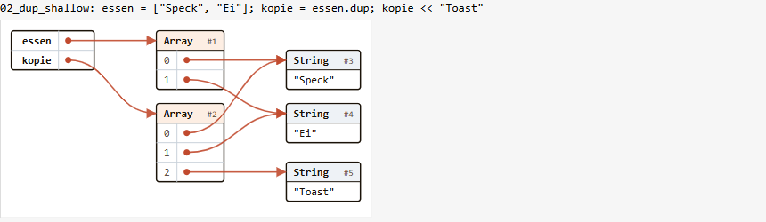

# 03 - `show_objects`: the object graph as boxes and arrows

Python Tutor's picture for Ruby: names on the left, objects as boxes, an
arrow for every reference. It is meant to make "a variable is a reference",
`dup` vs `=`, mutation through an alias, shallow copies, cycles and
`freeze` visible.

```ruby
a = [1, "x"]; b = a
show_objects(a: a, b: b)              # names => values
show_objects(binding)                 # every local variable of the cell
show_objects({ a: a }, max_depth: 2)  # a Hash of roots, then options
```



## Files

| File | What |
|---|---|
| `object_graph.rb` | the whole thing (~430 lines, no dependencies): walk, layout, SVG, `Kernel#show_objects` |
| `object_graph_test.rb` | Minitest, 9 tests / 30 assertions (`ruby object_graph_test.rb`) |
| `render_examples.rb` | writes `examples/*.svg` + `examples/index.html` |
| `examples/` | 9 rendered SVGs (open `index.html`) |
| `shots/` | PNGs of the examples (`ex01..09.png`, `gallery.png`) and of runs in the real page (`page_*.png`) |
| `serve.rb` | a static server: `html/` at `/`, this folder at `/og/` (for trying it in the page without touching shared files) |

## Design

**1. Walk (`ObjectGraph::Walker`) -> a graph description.** Breadth-first
from the roots, so a box's column is its shortest distance from a name.
Objects are identified by `__id__` (works for `BasicObject` too); one box per
object, however many references reach it - that is what makes sharing and
cycles show. `Graph = Struct(roots: [Slot], nodes: [Node])`, where a `Slot`
is a label plus either inline text or the id of a node, and a `Node` has a
title (class name), kind, slots or a body text, `frozen`, `depth`, and a
"... n more" count. This description is useful on its own (e.g. for
exercise checks) and is independent of the drawing.

- **Boxes**: String (its `inspect`), Array (index rows), Hash (key rows;
  keys are written inline), Struct and Data (member rows), Set, your own
  objects (`@ivar` rows). Things like Class, Range, Proc, Regexp, Time, and
  objects without ivars become a leaf box with their `inspect` (if it says
  more than `#<Foo>`).
- **Inline, no box**: Integer, Float, Rational, Complex, Symbol, nil, true,
  false. They are objects too, but immutable and shared; boxes for `1` would
  drown the picture. (A lesson can still say so.)
- **Frozen**: blue title bar, blue border, a ❄ after the class name. The
  examples show nicely that `freeze` is shallow (`["rot", "blau"].freeze` -
  the strings inside are not frozen).
- **Caps**: `max_depth: 6`, `max_nodes: 40`, `max_items: 10` (per
  container, then "… n more"), `max_text: 28` (inspect texts are cut with
  "…"). A reference that hits a cap is written as a grey "…".
- **Robust against user code**: `class`, `frozen?`, `instance_variables`,
  `instance_variable_get` are called as `Kernel` methods bound to the object
  (`bind_call`), so a class overriding them (or a `BasicObject`) does not
  break the walk; `inspect` errors are rescued.
- `show_objects(binding)` skips `_names`; in the course it also hides
  `TOPLEVEL_BINDING`'s locals - a cell binding is made inside
  `TOPLEVEL_BINDING` (main.rb `fresh_binding`), so without that `app_path`
  and `numo` from main.rb appeared in the picture (see
  `shots/page_binding.png`, taken before the fix).

**2. Layout (`ObjectGraph::Svg#layout`), pure Ruby.** Column 0 is the
"frame" (the names), column n the objects at distance n. Widths come from a
monospace estimate (7.4 px per character at 12 px, double for CJK/emoji).
In each column a box wants to sit level with the first slot that points at
it, and boxes never overlap (`y = max(wanted, previous bottom + gap)`).
This gives straight arrows for the common cases with ~30 lines of code.

**3. SVG (`ObjectGraph::Svg#render`).** Self-contained: inline attributes
(no external CSS, since an `` cannot see the page's CSS), an arrowhead
`<marker>`, the course's colours (ink, bacon arrows, bacon-fat title bars,
code-bg for strings, focus blue for frozen). Forward references are cubic
Béziers from the slot's dot to the target's left edge; a reference back (a
cycle, the same or an earlier column) leaves to the right and enters the
target's right edge, so self-references become a loop. All text is
XML-escaped (tested with REXML).

**4. Output.** `ObjectGraph::Picture` has `to_data_url`
(`data:image/svg+xml;base64,...`) - and `ChunkyApp#image_data_url` already
asks for `to_data_url` first, so `show_image(picture)` works *unchanged*.
`Kernel#show_objects` calls `show_image` when `ChunkyApp` is defined and
returns the `Picture` otherwise (plain CRuby, the check harness).

## Verified

- Plain CRuby 4.0.1: tests pass (`ruby -w`, no warnings); 9 examples
  rendered (alias, shallow dup, string alias, nested hash, object cycle and
  self-reference, frozen + Data + Struct, caps, a binding, a self-containing
  array with Japanese strings).
- **In the real page (ruby.wasm, 2026-10-04)**, port 18103 via `serve.rb`,
  loading the prototype in a cell with
  `eval(JS.global.fetchTextSync("og/object_graph.rb").to_s, TOPLEVEL_BINDING, "object_graph.rb")`
  (a cell's `require_relative` falls back to `JS::RequireRemote`, which
  needs an async eval and fails in a cell): `show_objects(...)` draws below
  the cell via the existing image path; `show_objects(binding)` with a
  custom class, a cycle and a frozen array works; the `ja` page with
  Japanese strings lays out correctly (`shots/page_ja_hash.png`).
- **Found**: as is, the picture is squeezed to 160 px, because
  `.cell-image` has `width: 160px; image-rendering: pixelated` (made for
  tiny ChunkyPNG pictures) - `shots/page_as_is.png`. One CSS rule fixes it
  (step 2 below; the other `page_*` shots have it injected).

## Limitations (proof of concept)

- Layout is a heuristic, not a graph-drawing algorithm: with many shared
  references edges cross (see `ex07.png`), and a back edge to an earlier
  column can cut through boxes in between. No edge routing around boxes, no
  crossing minimisation. Good for the 2-10 objects a lesson shows; a
  `binding` with a big structure gets busy (the caps keep it bounded).
- Text width is an estimate; the `` falls back to system monospace
  (the page's web fonts are not visible inside a data-URL image). Generous
  padding hides the difference; inline SVG (step 2b) would use the page font.
- Hash keys are written inline (`inspect`, 14 chars); a key that is itself a
  container is only named (`#<Array>`), not linked. That Hash#[]= dups and
  freezes String keys is not shown.
- Ruby 4.0 string literals are "chilled": `frozen?` is false, mutating one
  works but warns under `-w`. Nothing marks them as chilled (there is no
  public API to ask). Lesson cells below mutate arrays, not literals.
- Integers etc. are inline - deliberately; a "show everything" option
  (`inline: false`) would be a small addition.
- `object_id` is not printed; boxes are numbered `#1, #2, ...` in walk order
  (stable, short). Printing the real `object_id` would tie in with
  `a.object_id == b.object_id` - easy to switch.
- No animation/stepping (Python Tutor's other half); see experiment 02
  (time-travel tracer) - the two could combine: one graph per traced step.
- Several `show_objects` in one cell: each is its own image; inline SVGs
  would share the marker id `og-arrow` (identical definitions, harmless).

## Integration steps

1. **Ship the file**: copy `object_graph.rb` to `html/object_graph.rb`; in
   `main.rb` load it at boot next to the other helpers (`require_relative
   "object_graph"` at top level of main.rb works, since main.rb's own
   `require_relative` resolves our files remotely), or lazily on the first
   call like `shoes_dom.rb` (`$window.fetchTextSync("object_graph.rb")`).
   It is ~17 KB of source and has no dependencies. Add it to
   `html/offline-files.txt` (`ruby tools/offline_files.rb`).
2. **CSS** (`html/assets/app.css`), so the SVG keeps its natural size:
   ```css
   /* show_objects: an SVG at its own size, not a 160px pixel picture */
   .cell-image[src^="data:image/svg"] {
     width: auto;
     image-rendering: auto;
     border: 0;
     background: transparent;
   }
   ```
   2b. *Alternative*: write the SVG inline (`<div class="cell-objects">` +
   markup) via a new `@run_objects` list in `run_cell`. Pros: page fonts,
   selectable text, CSS-themable. Cons: one more widget list in `run_cell`
   and in `widgets_present`. The `` route needs only the CSS rule.
3. **Kernel helper**: with step 1 the `Kernel#show_objects` in
   `object_graph.rb` already works (it calls `show_image`). Move it into
   main.rb's "helpers available inside notebook cells" block if preferred;
   keep the `hide: TOPLEVEL_BINDING.local_variables` for bindings.
4. **Check harness** (`test/check_harness.rb`): `require_relative
   "../html/object_graph"` - its `show_objects` then goes through the
   harness's `show_image` stub, so `images` in checks gets the data URL.
   An exercise check can also inspect the structure directly, e.g.
   `ObjectGraph.graph({ a: a, b: b }).then { |g| g.roots[0].ref == g.roots[1].ref }`.
5. **Docs**: HANDOVER §3 "Helpers available in cells" and §6 widgets
   (the 160 px rule, the TOPLEVEL_BINDING hiding); README feature list.
6. **Companion gem** (`gem/chunky_bacon`, §10a): `show_objects` could write
   `objects.svg` there - `Picture#to_s` is the SVG.
7. Tests: copy `object_graph_test.rb` into `test/`; a `browser_test.mjs`
   check: run a cell with `show_objects`, expect
   `img.cell-image[src^="data:image/svg"]` with a natural width > 160.

## Lesson cells

Three demo cells (`t: "c"`) with a prose cell before each. Japanese runs the
English code with Japanese comments (HANDOVER §3).

### 1. Lesson "arrays" (7), after `<<`: two names, one array

```json
{ "t": "h",
  "de": "<p>Ein Variablenname ist ein <strong>Zettel an einem Objekt</strong>, keine Schachtel. <code>gleich = fruehstueck</code> klebt einen zweiten Zettel an <em>dasselbe</em> Array – <code>dup</code> macht ein neues. Die Pfeile zeigen es:</p>",
  "en": "<p>A variable name is a <strong>label stuck on an object</strong>, not a box. <code>same = breakfast</code> sticks a second label on the <em>same</em> array – <code>dup</code> makes a new one. The arrows show it:</p>",
  "ja": "<p>変数名は、オブジェクトに貼った<strong>ラベル</strong>です。箱ではありません。<code>same = breakfast</code>は、<em>同じ</em>配列にもう1枚ラベルを貼るだけ。新しい配列を作るのは<code>dup</code>です。矢印を見てみましょう：</p>" }
```
```ruby
# de
fruehstueck = ["Ei", "Brot"]
gleich = fruehstueck
kopie = fruehstueck.dup
gleich << "Speck"
show_objects(fruehstueck: fruehstueck, gleich: gleich, kopie: kopie)
```
```ruby
# en (ja: same code, comments in Japanese)
breakfast = ["egg", "bread"]
same = breakfast
copy = breakfast.dup
same << "bacon"
show_objects(breakfast: breakfast, same: same, copy: copy)
```
Afterwards: "`fruehstueck` has bacon now too - and `kopie` does not. But look
at the strings: the copy points at the *same* `"Ei"`. `dup` copies the
array, not what is in it."

### 2. Lesson "hashes" (8): a shallow copy

```json
{ "t": "h",
  "de": "<p><code>dup</code> kopiert nur die oberste Ebene. Steckt im Hash ein Array, teilen sich Original und Kopie dieses Array:</p>",
  "en": "<p><code>dup</code> only copies the top level. If the hash holds an array, the original and the copy share that array:</p>",
  "ja": "<p><code>dup</code>がコピーするのは、いちばん外側だけです。ハッシュの中に配列があると、元とコピーはその配列を共有します：</p>" }
```
```ruby
# de
fuchs = { name: "Kaz", mag: ["Speck"] }
klon = fuchs.dup
klon[:name] = "Isi"
klon[:mag] << "Toast"
show_objects(fuchs: fuchs, klon: klon)
```
```ruby
# en
fox = { name: "Kaz", likes: ["bacon"] }
clone = fox.dup
clone[:name] = "Isi"     # a new string: only clone changes
clone[:likes] << "toast" # the shared array: both change
show_objects(fox: fox, clone: clone)
```
(`shots/page_ja_hash.png` is this cell, in Japanese, in the real page.)

### 3. Lesson "klassen" (10): `==` is not `equal?`

```json
{ "t": "h",
  "de": "<p>Zwei Katzen mit demselben Namen sind trotzdem zwei Objekte. Jede hat ihr eigenes <code>@name</code>:</p>",
  "en": "<p>Two cats with the same name are still two objects. Each has its own <code>@name</code>:</p>",
  "ja": "<p>同じ名前のネコが2匹いても、オブジェクトは2つです。それぞれが自分の<code>@name</code>を持っています：</p>" }
```
```ruby
# de
mimi = Katze.new("Mimi")
noch_mimi = mimi
zwilling = Katze.new("Mimi")
show_objects(mimi: mimi, noch_mimi: noch_mimi, zwilling: zwilling)
```
```ruby
# en
mimi = Cat.new("Mimi")
also_mimi = mimi
twin = Cat.new("Mimi")
show_objects(mimi: mimi, also_mimi: also_mimi, twin: twin)
```
Then: "`mimi.equal?(also_mimi)` is true, `mimi.equal?(twin)` false - one
arrow target or two."

Further candidates: `freeze` is shallow (`ex06.png`); a linked list or a
tree of `Struct`s in a later lesson; `show_objects(binding)` as a "what is
in my notebook right now?" cell.
