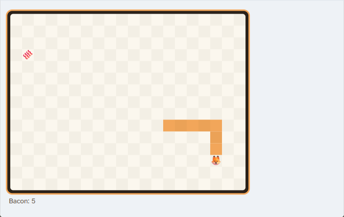
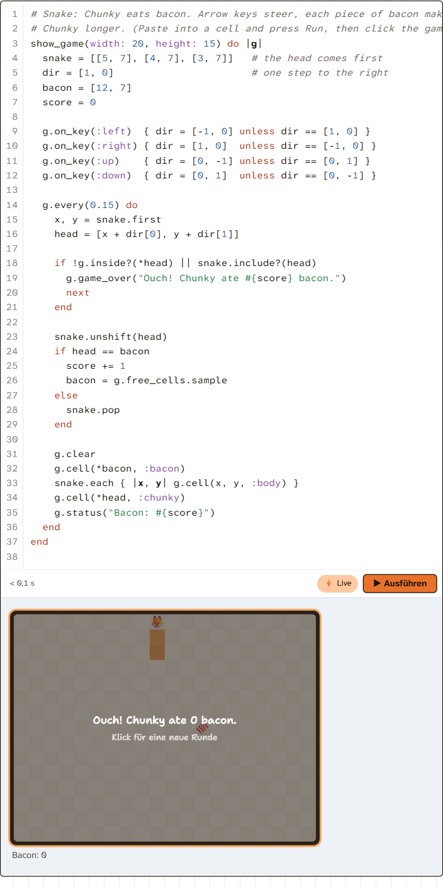

# 08 - a game loop in a cell: `show_game`

Snake runs in the real page: a lesson cell, ~35 lines of beginner Ruby
(`examples/snake.rb`), arrow keys, a game-over screen with "play again", and
it stops when the cell runs again or the lesson changes.

```ruby
show_game(width: 20, height: 15) do |g|
  snake = [[5, 7], [4, 7], [3, 7]]
  dir = [1, 0]
  g.on_key(:left) { dir = [-1, 0] unless dir == [1, 0] }   # ... up/right/down
  g.every(0.15) do
    head = [snake[0][0] + dir[0], snake[0][1] + dir[1]]
    next g.game_over("Ouch!") if !g.inside?(*head) || snake.include?(head)
    ...
    g.clear
    g.cell(*bacon, :bacon)
    snake.each { |x, y| g.cell(x, y, :body) }
    g.cell(*head, :chunky)
    g.status("Bacon: #{score}")
  end
end
```

 
`screenshots/`: playing, paused (focus lost), game over in the cell, and an endless
loop in a tick stopped by the time limit.

## Files

| File | What |
|---|---|
| `site/game.rb` | **new** `ChunkyGame` + `Kernel#show_game`. Plain Ruby, no JS: runs headless under CRuby too |
| `site/game.js` | **new** `window.chunkyGame(node, optsJson, step)`: the loop, the CSS grid, keys, swipes, clicks, overlay, stats |
| `site/main.rb` | copy of `html/main.rb` + the hooks (see `integration.diff`) |
| `site/index.html` | copy of `html/index.html` + `<script src="game.js">` |
| `serve.rb` | dev server for the prototype: `site/` over `html/`, examples too. `PORT=18108 ruby experiments/08-game-loop/serve.rb` |
| `examples/snake.rb` | the Snake |
| `examples/endless_snake.rb` | a snake that never dies, 20 steps/s - for measuring |
| `examples/bench.rb`, `bench_toplevel.rb` | cell code measuring the JS->Ruby call itself |
| `test/game_test.rb` | Minitest, plain CRuby: Snake driven headless (`ruby experiments/08-game-loop/test/game_test.rb`, 10 runs) |
| `test/play_snake.js`, `test/measure_guard.js` | Playwright (MCP `browser_run_code` with `filename`) against serve.rb: autopilot plays, re-run/pause/error/endless-loop checks, per-mode costs |
| `integration.diff` | the exact changes to `html/main.rb` and `html/index.html` |

## Architecture

CRuby runs on the main thread, so the learner's code can never loop or
`sleep` (sandbox_sim's `sleep` is virtual: a `loop { ...; sleep 0.15 }` would
just hang). So the **page owns the loop** and Ruby is a callback - the same shape
as `show_three`'s per-frame block (`renderer.animation_loop`) and
`show_letter`'s pen-lift block, both of which hand a Ruby block to JS through
jsg (ruby.wasm's `procToJsFunction`).

1. **During the run** `show_game` builds a `ChunkyGame` and runs the setup block
   right away (so its errors are the cell's errors), registering `on_key`,
   `on_click` and `every` handlers. The block can take `|g|` or not (then it is
   `instance_exec`'d: `every(0.15) { tick }` works with a top-level `def tick`).
2. **After the output is drawn** `mount_game` (main.rb) creates a node and calls
   `chunkyGame(node, opts, &block)` with the first full frame in `opts`.
3. **game.js** runs `requestAnimationFrame`, and calls Ruby **at most once per
   frame and only when something is due**: a timer (the previous answer says
   when: `next`) or events queued since the last frame (`"k:left|c:3,4|r"`).
   One crossing per call: events in as one string, the answer out as one JSON
   string: `{"d":[[index, look],...], "next": ms, "status", "over", "log", "error"}`.
   A look is `""`, an emoji, `"bg:#rrggbb"` (`:red`, `:body`, `"#0a0"`) or `"img:url"`.
4. **The grid** is a CSS grid of `<div>`s (cell size fits 480 px, 12..32 px);
   only the cells in `d` are touched, and only if their look changed. Render
   cost ~0.1 ms per frame.
5. **The game's clock** is game.js's own: it only advances while the game runs
   (max 100 ms per frame), so after a pause or a sleeping tab the timers do not
   fast-forward. Ruby additionally caps catch-up at 3 runs per timer per step.
6. **The game runs only while it has the focus.** "Click to play" overlay; a
   click (or Tab) focuses it, Esc or a click elsewhere pauses. That one rule
   solves several problems: the arrow keys never scroll the page or reach the
   editor, a live run (§6b) mounts a game but never starts it (verified: 0
   calls), two games on a page never both run, and the time limit (below) can
   be scoped to "while focused".
7. `puts` inside handlers goes into a small log under the grid (`$stdout`
   captured per step); an exception stops the game and shows
   `NoMethodError: ... (line 15)` under it.

### What stops a game

- **Re-run of the cell**: `run_cell` calls `dispose_games(idx)` (like
  `dispose_three`) -> `controller.stop()` + guard off. Verified: the old
  controller makes 0 calls after the re-run.
- **Lesson change / reset**: `sync_state` calls `dispose_games` for all.
  Verified the same way.
- **Belt and braces**: game.js stops by itself when `node.isConnected` is false.
- Game over, an error, or the time limit stop the calls too (no `next`).
- Not freed: ruby.wasm keeps the proc behind each JS function alive, so every
  mount leaks one closure (and the cell binding it holds) - the same as
  `show_letter` and `show_three` today. Small; mention if it matters.

### The time limit inside a tick

`▶` runs have no time limit (HANDOVER §6b), but a game calls Ruby later, from
the event loop, so `x += 1 while true` inside `every` would freeze the page
**for good** with no Run button to blame. The prototype reuses `AutoRun`'s
mechanism (TracePoint `:line, :b_call, :c_call`, clock every 128 events,
`AutoRun::Stopped` raised only on the learner's own file) as `GameGuard`:
**enabled when the game gets the focus, disabled when it loses it or stops**,
each step just moves the deadline (1 s). Verified: the endless loop is
stopped ~1.2 s after it starts, with
"Ein Schritt des Spiels hat länger als 1.0 s gedauert - eine Endlosschleife?".

Enabling a TracePoint per step instead (`AutoRun.with_time_limit` around each
call) costs ~4-6 ms extra **per step** in the page - CRuby re-instruments
every loaded iseq on enable/disable. Scoping it to the focus avoids that.

## Measurements (Chromium via Playwright, this machine, ruby.wasm 4.0)

Pure crossing cost (JS calls a Ruby block, `examples/bench*.rb`):

| | per call |
|---|---|
| empty block, nested in a Ruby call (JS loop inside a cell) | 0.20 ms |
| empty block, from the event loop (top level) | 0.13-0.21 ms |
| empty block, one call per `requestAnimationFrame` | 0.5 ms median (perf.now is 0.1 ms coarse) |
| returning a 40-char String instead of nil (`toJS`) | +0.01 ms |
| `game.step` for a Snake frame, called from Ruby, no JS | 0.14 ms (native CRuby: 0.02 ms) |

The real loop, `examples/endless_snake.rb` (20 steps/s, whole Snake frame
each step), 5 s per mode, fresh page each (`test/measure_guard.js`), game.js's
own per-call timing (Ruby step + JSON + crossing; rendering separately):

| time limit mode | median | avg | max |
|---|---|---|---|
| none (`$game_guard = false`) | 0.9-1.2 ms | 0.9-1.2 ms | 2.6 ms |
| **TracePoint on while focused, all events (default, `:focus`)** | **2.3 ms** | 2.5 ms | 6.2 ms |
| same, only `:line, :b_call` (`:lines`) | 1.6 ms | 1.8 ms | 4.6 ms |
| TracePoint enabled per step (`:tick`) | 6.1-7 ms | 6.3-8 ms | 15-24 ms |
| render (DOM diff) | 0.1 ms | | |

The `:focus` number was 8.7 ms before one fix in game.rb: `g.clear` iterated
all 300 cells in Ruby (each iteration a b_call + line + c_call events under
the TracePoint); it now keeps a Hash of the filled cells and touches only
those. **Lesson: under the guard, the cost is TracePoint events, so game.rb's
internals should avoid per-cell Ruby blocks** (`free_cells` still scans all
cells - fine, it runs only when bacon is eaten).

So a Snake at 6-7 steps/s costs ~15 ms of main thread per second with the
guard. 60 calls/s would be ~140 ms/s - still smooth (each call well under a
16 ms frame).

Side note: after any TracePoint has been enabled once, plain cells run ~40%
slower in this ruby.wasm (a 200k-iteration cell: 55-66 ms before, 83-96 ms
after, `TracePoint.stat` empty). Live runs (`AutoRun.with_time_limit`) already
cause this on every lesson page with ⚡ on, so games add nothing new - but it
might be worth a look for AutoRun itself.

## What works (verified in the page)

- Snake end to end: keys steer (the Playwright autopilot reached 5 bacon),
  bacon respawns on `g.free_cells.sample`, game over overlay, click -> setup
  block runs again (state in block locals restarts cleanly).
- Pause on blur: 0 calls while paused; the clock stands still.
- Re-run: old game stops (0 calls); lesson change: stops (0 calls).
- Live run: mounts with the "Click to play" overlay, 0 calls, the editor keeps
  the focus.
- Error in a tick: game stops, message with line number under the grid.
- Endless loop in a tick: stopped after ~1.2 s, message under the grid, page
  usable again; cells run normally afterwards (guard off).
- Headless: `ChunkyGame#press/#click/#advance` + `step`; `test/game_test.rb`
  (10 runs) drives Snake under plain CRuby.

API so far: `cell(x, y, look)` / `cell(x, y)` (`:outside` beyond the edge) /
`g[x, y] = look`, `clear`, `clear(x, y)`, `inside?`, `free_cells`,
`on_key(*keys) {}` / `on_key { |key| }`, `on_click { |x, y| }`,
`every(seconds) { |tick| }`, `status(text)`, `game_over(text)`, `stop`,
`over?`, `ticks`. Looks: 20 sprite names (`:chunky`/`:fox` 🦊, `:bacon` 🥓,
`:egg`, `:apple`, `:wall`, `:star`, `:ghost` ...), 12 colours (`:red`,
`:body` = Chunky's orange ...), `"#rgb"`, or any emoji string.

## Not done / open

- `:chunky` is the 🦊 emoji: `assets/chunky.svg` (`"img:assets/chunky.svg"`
  works) is unreadable at 24 px - a head-only sprite of Chunky would be nicer.
- Emoji rendering depends on the OS font (headless Chromium here draws 🥓 as a
  small red glyph). A sprite sheet in `assets/` would make it uniform.
- Labels are a `GAME_LABELS` constant in main.rb; they belong in lessons.js's
  `ui` (`gamePlay`, `gameKeys`, `gameAgain`, `gameTooLong`, `gameTitle`) via
  `ui[...]` like `ui["letter#{key}"]`.
- CSS is injected by game.js; move it to `assets/app.css` (and respect
  `prefers-reduced-motion` - nothing animates now anyway).
- No exercise check yet: `check_exercise` gets `games` (the ChunkyGame
  objects), so a check could do `g = games.first; g.press(:up); g.advance(0.15); g.cell(5, 6) == :chunky`.
  `test/check_harness.rb` would need the same `show_game` (game.rb works
  headless as is: without `ChunkyApp` it returns the game).
- The companion gem (`gem/chunky_bacon`): `show_game` could raise NotHere like
  `show_letter`, or game.rb could drive a terminal (curses) - out of scope.
- Workshop: works through the same `run_cell`/`mount_game` path (guard uses
  `Workshop.paths`) but was not tried there.
- A lesson: "Chunky's Snake" fits the side-trips group - build it in 5 steps
  (draw one cell, move it with `every`, steer with `on_key`, eat bacon, die).
- `AutoRun.runnable?`'s loop shapes: `:lines` (cheaper) misses one-line
  `while ... do ... end` loops; the default keeps `:c_call`.
- `$game_guard` is a prototype switch for the measurements - drop it on
  integration and keep the `:focus` behaviour.

## Integration steps

1. Copy `site/game.rb` and `site/game.js` to `html/`.
2. Apply `integration.diff` to `html/main.rb` (minus the `$game_guard`
   branches) and `html/index.html`:
   - `require_relative "game"` after autorun;
   - `@games = {}`; `dispose_games` in `sync_state` and in `run_cell`
     (`@run_games = []` next to `@run_letters`);
   - `@run_games.any?` in `widgets_present` (so a cell ending in `show_game`
     shows no `=> nil`);
   - `@run_games.each { |game| mount_game(idx, out_el, game) }` after the letters;
   - the `games` local for `check_exercise`;
   - the new section: `add_game`, `mount_game`, `GameGuard`, `dispose_games`;
   - `<script src="game.js"></script>` after letter.js.
3. Move `GAME_LABELS` into lessons.js `ui` (de/en/ja) and the CSS into app.css.
4. `tools/offline_files.rb` to add game.rb/game.js to `offline-files.txt`.
5. Add `show_game` to README's widget list and HANDOVER §6 (traps: page owns
   the loop; focus-scoped time limit; keep game.rb's internals event-light).
6. Tests: `test/game_test.rb` into `test/`, a browser_test step (run Snake,
   focus, press a key, `data-over` after hitting the wall, re-run stops it).
